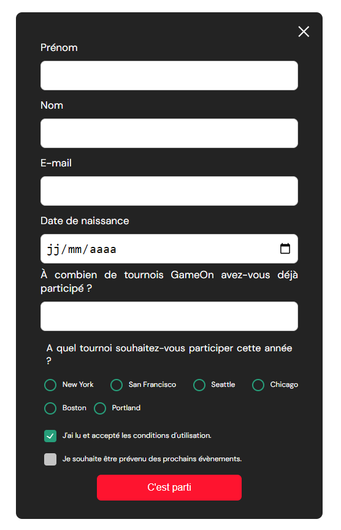
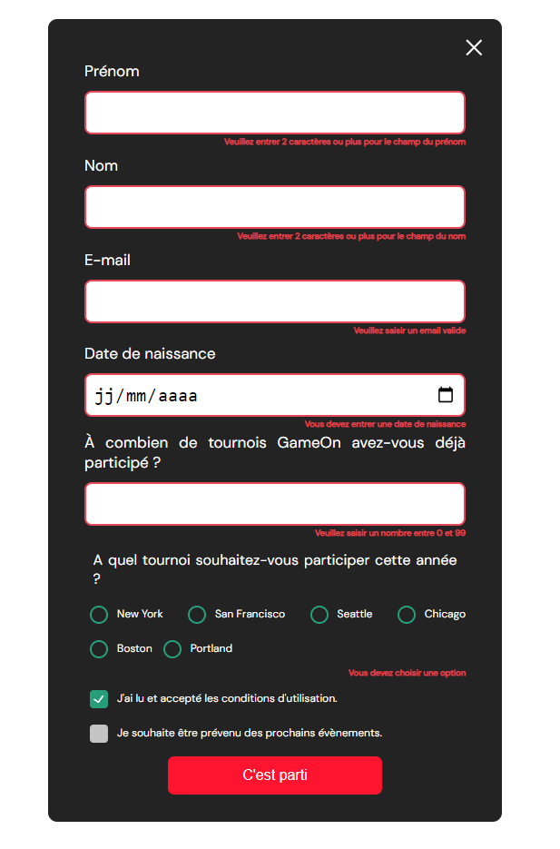

# Projet GameOn

En tant que développeur Front-end dans la PME GameOn, ma mission est de compléter le code déjà mis en place pour rendre fonctionnel le formulaire d'inscription.

Pour cela, il faut forker le repo existant et des issues ont été créees pour finir le travail.

Les issues : 

#1 Ajouter la fonctionnalité pour fermer la modale du formulaire.

#2 Implémenter les entrées du formulaire:

- Utiliser JS vanilla
- Le formulaire doit être valide quand l'utilisateur clique sur "Submit"   
- Les données doivent être saisies correctement :

    1- Le champ Prénom a un minimum de 2 caractères / n'est pas vide.

    (2) Le champ du nom de famille a un minimum de 2 caractères / n'est pas vide.

    (3) L'adresse électronique est valide.

    (4) Pour le nombre de concours, une valeur numérique est saisie.

    (5) Un bouton radio est sélectionné.

    (6) La case des conditions générales est cochée, l'autre case est facultative / peut être laissée décochée.

- Conserver les données du formulaire (ne pas effacer le formulaire) lorsqu'il ne passe pas la validation.

#3 Des messages d'erreur spécifiques doivent apparaître sous l'entrée qui n'est pas correcte. Les messages d'erreur doivent s'afficher sous le champ de saisie associé.

#4 Après une validation réussie, inclure un message de confirmation de la soumission réussie pour l'utilisateur (ex. "Merci ! Votre réservation a été reçue.")

#5 Visualiser et tester l'interface utilisateur dans les dernières versions de Chrome et de Firefox, ainsi que dans les versions mobile et desktop. Corriger les erreurs d'affichage existantes.
Tester toutes les fonctionnalités des boutons et des entrées de formulaire (tester les valeurs correctes et incorrectes)

### Homepage

### Formulaire d'inscription

       

